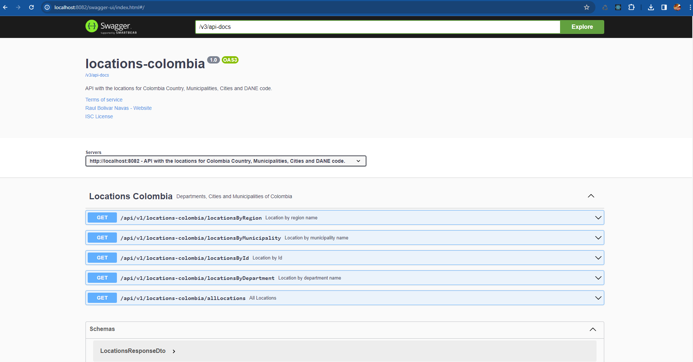

# locations-colombia

API with the locations for Colombia Country, Municipalities, Cities and DANE code.

---

- **DataSource**

```text
spring.datasource.url: 'jdbc:mysql://${BD_HOST}:3306/${BD_NAME}?useSSL=true'
spring.datasource.username: '${BD_USER}'
spring.datasource.password: '${BD_PASS}'
```

---

- **OpenAPI - OAS3**



---
*Raul R. Bolivar Navas **@rasysbox***